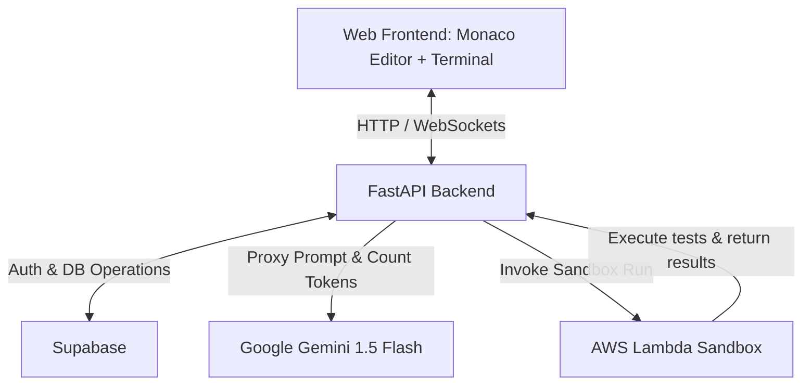

# Prompt Arena MVP: Product Requirements Document

This document outlines the requirements and system design for the **Prompt Arena MVP**, a competitive, timeboxed coding game where developers write code on the web using LLM assistance under a strict token budget limit.

---

## 1. Product Statement of Intent

*   **Outcome**: A web-based coding game with a side-by-side Monaco editor and simulated terminal, evaluating players on code correctness, token budget efficiency, and completion speed.
*   **User**: Invited & authenticated software engineers.
*   **Why now**: To evaluate spec-driven development, context window optimization, and prompt engineering in a fun, competitive, and zero-install environment.
*   **Success**: Players can play 1 game/day, code runtimes are sandboxed on AWS Lambda, scores are tracked in Supabase, and spectators see a live leaderboard.
*   **Constraint**: Low operational costs (using Gemini 1.5 Flash + AWS Lambda + Supabase free tier), strictly no local installation or local CLI setup required.

---

## 2. Tech Stack & Architecture

### Frontend
*   **Editor**: Monaco Editor (simulating a side-by-side editor view).
*   **Terminal**: Simulated terminal component (for executing test commands, displaying test runner output, and interacting with the LLM via CLI commands/prompts).
*   **Framework & Hosting**: Vite + React/TypeScript (compiled to a static Single Page App, hosted and deployed via **AWS Amplify Hosting** for automated Git-integrated CI/CD and serverless global delivery).

### Backend
*   **API Framework & Hosting**: Python (FastAPI), packaged as a Docker container and hosted on **AWS App Runner** (provides a managed, persistent, and auto-scaled container runtime with built-in HTTPS and zero-cold-start performance).
*   **LLM Proxy**: Intercepts player prompts, sends them to Gemini 1.5 Flash, calculates actual tokens used (input/output), logs the usage, and updates the player's budget.
*   **Sandbox Executer**: Invokes an **AWS Lambda** runner with the user's code and problem test suite.

### Database & Auth
*   **Provider**: **Supabase** (PostgreSQL) database.
*   **Auth**: Supabase Auth (Passwordless Magic Link or email OTP).
*   **Data Model**: Relational structure mapping users, challenges, game sessions, and scorecards.

---

## 3. Core Mechanics & Rules

1.  **Challenge Scope**: Backend coding tasks only. No frontend-specific tasks (e.g., UI visual layout or DOM manipulation) or system design diagrams.
2.  **Runtimes Supported**: Python and Node.js/TypeScript.
3.  **Time Limit**: Exactly 30 minutes. The session automatically terminates and submits when the timer hits zero.
4.  **Token Budget**: A hard cap on Gemini API tokens. The LLM proxy will block further prompts if the budget is exceeded.
5.  **Game Limit**: Restrained to exactly **1 game per user per day** to control API costs.
6.  **Submission Scope**: Single-file code submissions to keep the sandboxed runner simple.

### Scoring Formula
$$\text{Total Score} = \frac{\text{Correctness} + \text{Efficiency} + \text{Speed}}{3}$$
*   **Correctness**: $\frac{\text{Passed Unit Tests}}{\text{Total Unit Tests}} \times 100$
*   **Efficiency**: $\frac{\text{Token Budget} - \text{Tokens Used}}{\text{Token Budget}} \times 100$ (if tokens exceed budget, Efficiency is 0)
*   **Speed**: $\frac{\text{Remaining Time (seconds)}}{\text{Total Time (1800 seconds)}} \times 100$

---

## 4. User Journeys

### Player Journey
1.  **Authentication**: Player logs in via a Magic Link.
2.  **Dashboard**: Player views the active leaderboard and selects a difficulty level (Easy, Medium, Hard). If they've already played their daily game, they cannot start a new one.
3.  **Pre-Flight Setup & Start**: The player selects their language (Python or Node/TypeScript). They are presented with a "Start Challenge" modal explaining the rules, token budget, and 30-minute time constraint. Clicking **"Start Challenge"** sends a request to the backend, creating a active game session in Supabase with a server-backed `started_at` timestamp. This initiates the timer.
4.  **Arena Workspace**:
    *   **Left Pane**: Challenge statement, acceptance criteria, remaining token budget, and remaining time (synced to the server-tracked countdown).
    *   **Middle/Right Pane**: Monaco code editor displaying the starter file.
    *   **Bottom Pane**: Simulated terminal. Players can type `run tests` (which uploads the code to the backend, executes it in AWS Lambda, and outputs test results) or prompt the LLM directly in the terminal to request assistance.
5.  **Game Termination**: Triggered by manual submission, time expiration, or token budget exhaustion. The final test suite is run, the score is calculated, and the scorecard is saved in Supabase.

### Spectator Journey
1.  **Dashboard**: Spectators visit the public web dashboard.
2.  **Leaderboard**: Spectators view a live-updated leaderboard sorted by total score.
3.  **Scorecard Details**: Spectators can click on a scorecard to view the player's completion code, test breakdown, and token usage statistics.

---

## 5. Security & Sandbox Design

### AWS Lambda Executor
*   When a player runs tests, the FastAPI backend invokes a dedicated AWS Lambda function.
*   **Payload**: The user's code, the language environment (Python or Node/TS), and the test suite file.
*   **Isolation**: Lambda isolates the execution in a Firecracker microVM. Execution time is capped to 5 seconds, and network access is disabled within the execution function.
*   **Output**: Returns stdout, stderr, and the test results JSON back to the backend.

---

## 6. Out of Scope for MVP
*   Frontend-specific visual/visual-diffing challenges.
*   System design challenges.
*   Multi-file project workspaces for players.
*   Multi-game-per-day allowance.
*   Custom user-supplied LLM API keys (BYOK).
