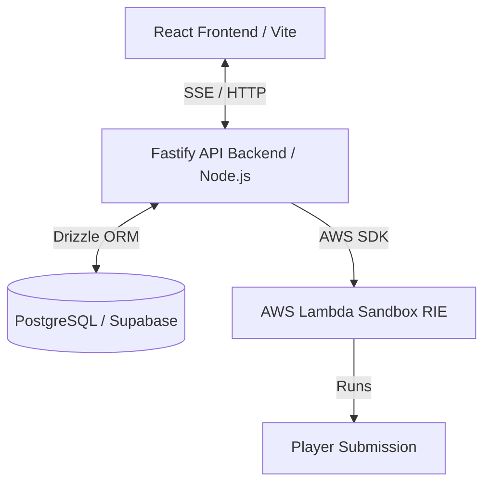
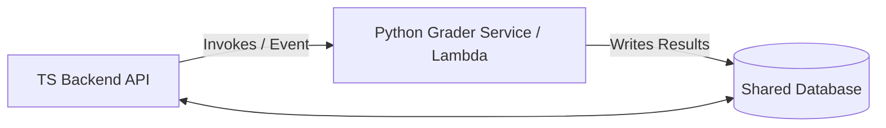

# Prompt Arena Rebuild Proposal

This document outlines the proposed architectural, structural, and technical blueprint for rebuilding the Prompt Arena platform. These recommendations are based on our discussion, focusing on type safety, modularity, security, performance, and developer experience.

---

## 1. Core Technology Stack



### Frontend (Apps & Presentation)
* **Framework**: React 18+ (TypeScript) built with Vite for fast local building and a lightweight single-page application (SPA) footprint.
* **Styling**: Vanilla CSS for layouts, ensuring visual animations, premium aesthetics (glassmorphism/dark mode), and absolute visual control.
* **Editor**: Monaco Editor (React wrapper) to emulate a premium side-by-side IDE experience.

### Backend (Business Logic & Orchestration)
* **Runtime**: Node.js with TypeScript.
* **Framework**: Fastify (or Express). Fastify is recommended due to its low overhead, native schema validation support, and excellent speed for long-running connections (SSE).
* **Validation**: **Zod** for request/response schemas, shared across both the frontend client and the backend server.

### Database & ORM
* **Database**: PostgreSQL (managed via Supabase).
* **ORM**: **Drizzle ORM** using direct PostgreSQL TCP connections (via connection pooler) for server-side queries.
* **Migration Manager**: `drizzle-kit` for version-controlled migration generation and execution.

---

## 2. Cloud Infrastructure Strategy

To maximize security and control while keeping operational costs and latency low, we recommend a **Unified AWS** cloud strategy.

* **API Backend**: **AWS App Runner** or **ECS Fargate**. Long-lived containerized hosting that scales automatically based on request traffic, with direct access to AWS VPC networking.
* **Execution Sandbox**: **AWS Lambda (Container Image)**. 
  * Player code submissions run inside isolated, ephemeral container instances.
  * AWS Lambda uses Firecracker microVMs under the hood, separating the execution environment from the host kernel.
  * Run within a dedicated private VPC subnet with **zero internet gateway routes** (no network egress) to block code submissions from contacting external APIs or data exfiltration routes.
* **Static Assets (Frontend)**: **AWS S3** served via **Amazon CloudFront** CDN for low-latency distribution.
* **Database**: Managed PostgreSQL on Supabase (configured in the same AWS region, e.g., `us-east-1`, to eliminate cross-region network latency).

---

## 3. Workspaces Monorepo & Directory Structure

To simplify dependency sharing and guarantee compile-time type safety across the stack, the project will be structured as a **pnpm or npm workspaces monorepo**:

```text
/ (Monorepo Root)
  ├── package.json
  ├── pnpm-workspace.yaml         # Configures workspaces for packages and apps
  ├── tsconfig.base.json          # Shared base compiler options
  │
  ├── apps/
  │   ├── web/                    # React frontend application
  │   │   ├── src/
  │   │   │   ├── components/     # Shared, reusable presentation components (buttons, cards, layout)
  │   │   │   ├── features/       # Feature-driven UI code (auth, arena, leaderboard)
  │   │   │   └── main.tsx
  │   │   └── package.json
  │   │
  │   ├── api/                    # Node/TS backend server
  │   │   ├── src/
  │   │   │   ├── features/       # Feature-driven API logic (auth, challenges, sessions)
  │   │   │   │   └── [feature]/  # Controller, Service, and endpoint-specific schemas
  │   │   │   └── server.ts
  │   │   └── package.json
  │   │
  │   └── sandbox/                # Code executor container code for AWS Lambda
  │       ├── src/
  │       │   ├── runtimes/       # Node.js and Python test runners
  │       │   └── handler.ts      # Lambda invocation handler
  │       └── package.json
  │
  ├── packages/                   # Shared internal workspaces
  │   ├── db/                     # Drizzle schema definitions and migrations
  │   │   ├── src/
  │   │   │   ├── schema.ts       # TypeScript database schema
  │   │   │   └── client.ts       # Database client connection setup
  │   │   ├── migrations/         # Generated SQL migrations (drizzle-kit)
  │   │   └── drizzle.config.ts
  │   │
  │   ├── types/                  # Shared domain types, contracts, and DTOs
  │   │   └── src/index.ts
  │   │
  │   └── config/                 # Shared configs (ESLint rules, prettier, base TSConfigs)
  │
  ├── supabase/                   # Local Supabase Auth and database emulator setup
  └── infra/                      # Infrastructure as Code (AWS CDK)
```

---

## 4. Key Architectural & Operational Improvements

Based on the opportunity to rebuild from scratch, we have adopted these five specific improvement vectors:

### 1. End-to-End Type Safety via Zod
We define all API request parameters, query strings, and response payloads as **Zod schemas** in `packages/types` (or imported directly from `apps/api`).
* **Backend**: Fastify validates incoming request payloads against these Zod schemas, returning a standard `400 Bad Request` if validation fails.
* **Frontend**: The React client uses the same schemas with `z.infer<T>` for form validation and API requests, ensuring complete contract synchronization.

### 2. Sandbox Execution Caching
To optimize performance and reduce cloud costs:
* We compute a SHA-256 hash of the player's submitted `code + test_suite + runtime_language`.
* Before spinning up a Lambda sandbox execution, the API checks a `sandbox_cache` table.
* If a match is found, we return the cached `stdout, stderr, passed, test_results` instantly.
* This dramatically speeds up test execution loops when players run their code without making changes.

### 3. Event Logging for Spectator Replays
Instead of storing only the latest status in the `game_sessions` table, we will log every interaction:
* Every prompt sent by the player, the LLM's response, and token count.
* Every code submission attempt, test results, and timestamp.
* These are logged to a `session_events` audit table.
* **Result**: Spectators can access a "Time-Lapse Replay" viewer, visually scrubbing through the player's coding session step-by-step.

### 4. Server-Sent Events (SSE) for Real-Time Streaming
Rather than maintaining complex, bidirectional WebSockets:
* The client connects to a standard HTTP endpoint (`GET /api/challenges/session/:id/stream`).
* The API streams sandbox execution logs, status updates (Compiling -> Running -> Finished), and LLM text tokens using **Server-Sent Events (SSE)**.
* SSE is native to browsers, uses standard HTTP headers, handles automatic reconnection, and scales easily through standard reverse proxies without resource leaks.

### 5. AWS Lambda RIE for Local Development Parity
To avoid environment discrepancies:
* The local development stack runs the `apps/sandbox` container using the official **AWS Lambda Runtime Interface Emulator (RIE)**.
* Locally, the API points its AWS Lambda Client to the local container endpoint `http://localhost:8080`.
* This eliminates the need for heavyweight local emulators like LocalStack while ensuring that the exact container environment used in AWS Lambda is running locally.

---

## 5. Future-Proofing & Extensibility (AI/Python Evolution)

If Prompt Arena evolves in the future and needs Python-specific features (such as AST parsing for code complexity scoring, custom prompt injection detection models, or running local Small Language Models), we **do not need to rewrite the main API backend in Python.** 

Instead, we can use a **decoupled service architecture**:



1. **Decoupled Grader / Evaluation Service**:
   * Keep the main web layer, user sessions, auth, and HTTP/SSE APIs in **TypeScript**.
   * Spin up a dedicated, lightweight Python service (or separate AWS Lambda function) *specifically* to handle AST code parsing or ML-based scoring.
   * When a game finishes, the TS Backend calls the Python Grader Service via standard REST/gRPC or an event queue.
2. **Shared Database Contracts**:
   * Both the TS Backend (via Drizzle) and the Python service (via raw SQL or SQLAlchemy) can connect to the same Supabase PostgreSQL instance.
   * The Python service computes complex metrics, saves them directly to `scorecards` or a `grading_results` table, and notifies the TS backend.
3. **Event-Driven Background Workers**:
   * For non-blocking evaluations (e.g. detailed post-game prompt analytics), the TS Backend can publish an event (via Postgres Listen/Notify or SQS). A Python worker processes the event offline and writes the results back to the database.

This keeps our core web application clean, type-safe, and highly performant, while allowing us to tap into Python's rich AI library ecosystem only where it is actually needed.
