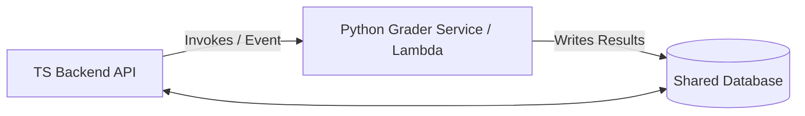

# Product Requirement Document: Prompt Arena

## 1. Objective & Goal
* **Problem**: In the era of generative AI assistants, assessing a software engineer's capability purely on raw code typing speed is outdated. Modern development requires developers to excel at spec-driven coordination, context window optimization, and prompt engineering. However, no gamified competitive platform exists that evaluates these modern developer skills while enforcing strict token budgets, timing constraints, and secure code execution in an isolated sandbox.
* **Objective**: Build **Prompt Arena**, a web-based competitive coding game where players solve spec-driven challenges. The system features a side-by-side Monaco editor and simulated console terminal, scoring developers on code correctness, token budget efficiency, and completion speed. The platform uses a full-stack TypeScript monorepo architecture, leveraging AWS Lambda for sandbox code execution and Google Gemini for inline developer prompting.
* **Why now**: The software engineering landscape is moving from manual code writing to prompt-driven orchestration. Prompt Arena establishes a secure, competitive, and cost-controlled game framework to evaluate these emerging developer competencies.

---

## 2. User Personas
* **Invited Developer (Player)**: A software engineer competing in a spec-driven, time-limited coding arena. They need a fast, low-latency, and responsive coding environment with Monaco editor, real-time terminal output, and prompt helper capabilities.
* **Spectator**: A public viewer visiting the platform. They want to see the live leaderboard and play back completed player sessions step-by-step (time-lapse) to learn different prompt/coding strategies.
* **System Administrator**: Responsible for platform operating costs and safety. They require strict API call budgets, prevention of double-game submissions, and secure code sandboxes to block malicious code.

---

## 3. Core User Journeys

#### Journey 1: Starting a Daily Challenge
* **Pre-flight Check**: The player logs in using Magic Link or OTP authentication. If this is their first sign-in (new account signup), the system forces them to select and save a unique, non-empty username before they can access any challenges.
* **Daily Limit Verification**: The API checks the database to verify if the player has already played a challenge on the current calendar date (standardized to UTC). If they have, they are blocked and shown a "Daily Limit Reached" error.
* **Session Initialization**: The player selects a challenge, chooses their preferred programming runtime (Python or Node.js/TypeScript), and clicks "Start". The server records a `started_at` timestamp, creates an active session in PostgreSQL, initializes the credit budget (e.g. 50,000 credits), binds the active version of the difficulty costing ruleset (`pricing_ruleset_id`), locks the targeted LLM model (e.g. `gemini-1.5-flash`) specified by the challenge configuration, and redirects the player to the workspace.

### Journey 2: Coding and Execution (The Sandbox)
* **Writing Code**: The player edits a single solution file inside the Monaco editor.
* **Running Tests**: The player types `run tests` in the simulated terminal. The frontend sends the code to the API. 
* **Caching & Execution**: The API hashes the code and test suite. If an identical run exists in the cache, the API returns the cached output instantly via a standard HTTP JSON response. Otherwise, the API invokes the AWS Lambda sandbox container. The test runner compiles and runs the code within its strict resource limits, returning stdout/stderr and unit test passes/fails.

### Journey 3: Interacting with the Prompt Engine
* **Prompting**: The player enters a prompt in the terminal to ask the LLM for assistance. The active target model is explicitly displayed in the workspace header (e.g. *"Powered by Gemini 1.5 Flash"*).
* **Guardrails & Credit Deduction**: 
  1. The API intercepts the prompt, appends architectural guide system prompts (blocking direct code solutions), and estimates the input tokens ($T_{\text{in}}$) offline.
  2. The server calculates the available budget for output tokens ($C_{\text{out\_avail}}$) by subtracting the transaction fee and the weighted input cost:
     $$C_{\text{out\_avail}} = C_{\text{rem}} - \text{Transaction\_Fee} - (T_{\text{in}} \times \text{Input\_Multiplier})$$
     If $C_{\text{out\_avail}} \le 0$, the prompt is immediately blocked.
  3. The server computes the maximum allowed output tokens:
     $$T_{\text{out\_max}} = \lfloor \frac{C_{\text{out\_avail}}}{\text{Output\_Multiplier}} \rfloor$$
  4. The request is routed to the Gemini API with the dynamic constraint `maxOutputTokens: T_{\text{out\_max}}` to prevent any wallet overrun.
  5. The final prompt and response credits are deducted atomically from the player's session budget using the difficulty costing levels retrieved from the bound `pricing_ruleset_id` database record:
     * **Easy Difficulty**: Input Multiplier = $2.0\times$, Output Multiplier = $6\times$, Flat Fee = $50$ Credits.
     * **Medium Difficulty**: Input Multiplier = $2.5\times$, Output Multiplier = $8\times$, Flat Fee = $150$ Credits.
     * **Hard Difficulty**: Input Multiplier = $3.0\times$, Output Multiplier = $10\times$, Flat Fee = $300$ Credits. *Special rule: Output tokens exceeding 150 cost $20\times$ credits.*
  6. The spent credits, raw tokens, and prompt/response details are logged in the event table. If the budget reaches $0$, future prompts are blocked. During streaming, if the in-memory credits drop to 0, the SSE connection is cut off immediately.

### Journey 4: Session Termination & Scoring
* **Completion**: The game ends when the player clicks "Submit", the 30-minute timer hits zero, or the credit budget is exhausted ($0$ credits remaining).
* **Evaluation**: The backend runs a final, official test suite verification.
* **Scorecard Generation**: The final scorecard is computed using:
  $$\text{Total Score} = \frac{\text{Correctness Score} + \text{Efficiency Score} + \text{Speed Score}}{3}$$
  * **Correctness**: Percentage of passed unit tests (0–100%).
  * **Efficiency**: Percentage of remaining credit budget (0–100%):
    $$\text{Efficiency Score} = \left( \frac{\text{Remaining Credits}}{\text{Initial Credit Budget}} \right) \times 100$$
  * **Speed**: Percentage of remaining session time (0–100%).
* **Finalization**: The session status is closed, and the player is shown their scorecard.

### Journey 5: Spectator Replay Playback
* **Replay**: A spectator clicks on a player's scorecard from the leaderboard. The client fetches the chronological session event log (`session_events`). The spectator is shown the Monaco editor and can step forward/backward through each prompt submission, LLM response, and test runner output, watching a reconstructed time-lapse of the player's run.

---

## 4. Prioritized Requirements (MoSCoW)

### Must Have
* **Full-stack TypeScript Monorepo**: Shared typings and models between the React client and Fastify backend.
* **Drizzle ORM Integration**: Type-safe database queries against PostgreSQL database (managed via Supabase).
* **Strict Daily Limit Check**: Prevent more than 1 session per user per calendar day (UTC) at the database constraint level using a functional unique index or constraint.
* **AWS Lambda Sandbox**: Execute Node.js and Python submissions in isolated Lambda environments with no network egress.
* **LLM Proxy & Guardrails**: Enforce difficulty-based credit budgets, compute dynamic max output constraints, and intercept Gemini prompts to insert anti-solution rules.
* **Zod Validation**: Unified Zod schemas to parse and validate request payloads.
* **Hierarchical Score Tie-Breaking**: Leaderboard ranks ties based on Correctness first, then Efficiency (remaining credit percentage), then Speed, and finally chronological submission timestamp.

### Should Have
* **Sandbox Execution Caching**: Cache executions by hashing `code + test_suite + runtime` to eliminate redundant Lambda execution fees and latency. Cached runs return standard HTTP JSON responses immediately (mocking execution state transitions via SSE is deferred as a future improvement).
* **Event Logging (Replays)**: Log all prompts, replies, test logs, and code snapshots to the database to reconstruct the session history.
* **Server-Sent Events (SSE)**: Stream terminal compile logs and LLM responses to the client using SSE instead of WebSockets.
* **AWS Lambda RIE Local Emulation**: Run the Lambda container locally using RIE for 100% dev-prod environment parity.

### Could Have
* **Prompt Caching**: Cache identical LLM prompt requests to save API tokens.
* **Performance Dashboard**: Real-time admin views tracking active sandboxes, average response times, and LLM billing quotas.

### Won't Have (Deferred / Out of Scope)
* **Real-time Live Typing Spectating**: Broadcasting active player keystrokes live (standardized on historical time-lapse replay instead).
* **Multi-file Project Support**: Codebase workspace remains locked to single-file code solutions.
* **Runtimes Beyond Python/Node.js**: No Go, Rust, or C++ support for sandbox submissions.

---

## 5. Technical & Non-Functional Constraints

### Architecture, Folder Structure, & Modularity
The codebase must be structured as a **workspaces monorepo** (using `pnpm` or `npm`) to guarantee type sharing, package isolation, and developer readability:

```text
/ (Monorepo Root)
  ├── package.json
  ├── pnpm-workspace.yaml         # Configures workspaces for packages and apps
  ├── tsconfig.base.json          # Shared base compiler options
  │
  ├── apps/
  │   ├── web/                    # React (TypeScript) + Vite frontend SPA
  │   │   └── src/
  │   │       ├── components/     # Global shared UI elements (Button, Input, etc.)
  │   │       └── features/       # Grouped by domain feature (auth, challenges, leaderboard)
  │   │           └── challenges/
  │   │               ├── components/  # Feature-specific subcomponents (CodeEditor.tsx)
  │   │               ├── hooks/       # Feature-specific React hooks (useSandboxRunner.ts)
  │   │               ├── services/    # Feature-specific HTTP/API clients
  │   │               └── pages/       # Feature page layouts (ChallengeArenaPage.tsx)
  │   │
  │   ├── api/                    # Node.js + Fastify backend API (TypeScript)
  │   │   └── src/
  │   │       └── features/       # Domain features containing all handlers, business logic, schemas
  │   │           └── challenges/
  │   │               ├── routes.ts    # Fastify route definitions
  │   │               ├── handlers.ts  # Controllers / route entry points
  │   │               ├── services.ts  # Core domain service logic
  │   │               ├── repository.ts # Database queries specific to challenges
  │   │               └── schemas.ts   # Local request validation configurations
  │   │
  │   └── sandbox/                # Code executor container package (Dockerized runner for Lambda)
  │
  ├── packages/                   # Shared monorepo packages
  │   ├── db/                     # Drizzle schema, SQL migrations, and global connection client
  │   ├── types/                  # Shared Zod schemas, payload definitions, and API DTO contracts
  │   └── config/                 # Shared configs (ESLint, TSConfig, Prettier)
  │
  ├── supabase/                   # Local Supabase config & seeds for local auth emulation
  ├── infra/                      # AWS CDK infrastructure definition
  └── scripts/                    # Shared automation, database seeding, and CI utility scripts
```

#### Modularity & Coding Constraints
* **Shared Types & DTO Contracts**: All payload shapes (requests, responses, event triggers) must be defined as Zod schemas inside `packages/types`. Both the `apps/api` and `apps/web` must import these schemas directly. If the backend changes a schema, the frontend build must fail at compile time.
* **Database Isolation**: The database schema and connection client initialization live exclusively in `packages/db`. No application (`apps/api` or other services) should write raw migrations or configure custom drivers; they must import `@prompt-arena/db`.
* **Feature-Encapsulated Queries**: Database query/repository logic must live directly within its corresponding domain feature folder (e.g. `apps/api/src/features/challenges/repository.ts`) rather than in a global query package. Feature repositories access the database using the shared `@prompt-arena/db` client.
* **Service Classes by Default**: Group domain actions inside cohesive service classes (e.g. `ChallengeService`) rather than introducing complex `Command` or `UseCase` files. Standalone use-case or command classes should only be created for highly complex, multi-step transaction pipelines (such as execution grading).
* **Ports & Adapters for Infrastructure**: Interface boundaries (Ports) must only be defined for external infrastructure and third-party systems that vary across environments. Internal repository and database logic must mock concrete classes/drivers directly. The project defines exactly two major interfaces:
  * `SandboxRunner`: Swappable between AWS Lambda execution (production), local Docker container execution (development), and mock test execution.
  * `LlmProvider`: Swappable between live API calls (Gemini/OpenAI) and stub/mock providers for offline tests.
* **Atomic Budget Updates**: The remaining credit budget must be tracked as a mutable column (`remaining_credits`) in the `game_sessions` table and updated atomically via SQL transactions to prevent concurrent requests from bypassing the budget.
* **Versioned Pricing & Model Schemes**: Costing rules (multipliers, flat fees, progressive penalty tiers) must be stored in a `pricing_rulesets` database table. Each challenge configuration in the database must specify the targeted LLM model (e.g. `gemini-1.5-flash`). Each `game_sessions` record must maintain foreign keys to both the `pricing_ruleset_id` and the targeted model metadata configuration active at the time of game creation to guarantee historical playback integrity.
* **Feature-Driven Folders**: Code in `apps/web` and `apps/api` must be grouped by domain features (e.g. `features/auth/`, `features/challenges/`) rather than functional layers (e.g. controllers, services, models). All code related to a single feature should live in one cohesive directory.

### Extensibility & Future-Proofing (AI/Python Evolution)
To support potential AI feature growth (such as complex Python-based code analysis, model evaluation grading, or prompt injection filters) without diluting the TypeScript backend's concurrency strengths, the project must adhere to a **decoupled service architecture**:



* **Specialized AI/Analysis Workers**: Keep the main web API and session state orchestrator in TypeScript. Any specialized python-based data/AI parsing must be offloaded to isolated Python microservices or AWS Lambda functions.
* **Shared Database Access**: Any secondary Python worker or grader service must connect directly to the shared Supabase PostgreSQL database using standard TCP connections to read or update scorecards, sharing schema definitions through the database layout.
* **Non-blocking Event Loops**: High-latency grading or analytics operations must be executed asynchronously using PostgreSQL Listen/Notify or message queues (AWS SQS), keeping the user's primary Fastify HTTP thread responsive.

### Security & Sandbox Isolation
* **Execution Timeout**: ephemerally capped at a maximum of **5 seconds** per run.
* **Zero Network Access**: Sandbox VPC subnets must have no internet gateway routing table entries.
* **Resource Limits**: Sandboxes must be strictly capped at **256MB RAM**, **1 vCPU**, and capture a maximum of **64KB** of stdout/stderr logs to prevent infinite loop memory blowups.
* **API Key Safety**: Gemini API keys and Supabase service role keys must never expose themselves to client-side network requests.

### Performance & Latency
* **API Overhead**: Core database transactions and security checks before proxying LLM/Sandbox calls must add $\le 50\text{ms}$ of latency.
* **Local Development**: Developer boot up must rely strictly on standard `docker-compose` with standard base container images emulating AWS Lambda natively via Runtime Interface Emulator (RIE).

---

## 6. Risks & Dependencies

* **Upstream Gemini API Outages**: Platform operation depends on Google Generative AI availability. *Mitigation: Gracefully capture API errors and report offline status without scoring penalty.*
* **AWS Lambda Cold Starts**: First sandbox run of a session could experience an initial latency increase (cold start). *Mitigation: Pre-warm a small pool of Lambdas or optimize the runtime image size under 500MB.*
* **Connection Limits**: Heavy traffic could exceed the PostgreSQL connection cap. *Mitigation: Run connections via a PostgreSQL connection pooler (Supavisor) rather than direct TCP sessions.*

---

## 7. Success Metrics
* **100% Credit/Wallet Leakage Protection**: No user session can bypass its allocated credit budget, ensuring 0% financial overrun.
* **Zero-Trust execution**: 0% of malicious user code submissions bypass the container sandbox to affect the host server or network.
* **Fast Developer Bootstrapping**: A developer can clone the monorepo, run `make setup`, and start the entire stack locally in $\le 5\text{ minutes}$.
